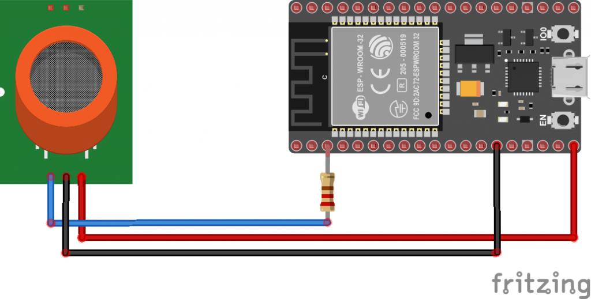

# **Gas Analyzer Project**


## **Gas Analyzer Project: Industry-Level Usage**

Air quality management is a critical concern, particularly in industrial environments where emissions of harmful gases are prevalent. This project aims to develop a cost-effective gas analyzer suitable for industry-level usage, capable of detecting gases such as Carbon Monoxide (CO), Methane (CH₄), Ammonia (NH₃), LPG, and Alcohol (Ethanol).

The system leverages the ESP32 microcontroller for real-time data collection and monitoring via Wi-Fi or Bluetooth. By utilizing low-cost MQ sensors, the solution ensures affordability without compromising on essential features, such as threshold-based alerts, data logging, and cloud connectivity for remote supervision.

## **Index**
- [**Introduction**](#introduction)
- [**Key Sensors**](#key-sensors)
- [**Project Overview**](#project-overview)
- [**Hardware Requirements**](#hardware-requirements)
- [**Software Requirements**](#software-requirements)
- [**Circuit Diagram**](#circuit-diagram)
- [**Installation**](#installation)
- [**Usage**](#usage)
- [**Testing and Validation**](#testing-and-validation)
- [**Troubleshooting**](#troubleshooting)
- [**Future Enhancements**](#future-enhancements)
- [**Contributing**](#contributing)
- [**License**](#license)
- [**Appendix: Additional Resources**](#appendix-additional-resources)


### **Key Sensors**
Here’s a table comparing the chosen sensors (MQ2, MQ7, and MQ135) with some alternatives, along with reasons why these sensors were selected:

| **Sensor**  | **Gases Detected**                  | **Concentration Range (ppm)** | **Response Time**   | **Reason for Selection**                            | **Alternatives**         |
|-------------|-------------------------------------|-------------------------------|---------------------|-----------------------------------------------------|--------------------------|
| **MQ2**     | Methane, LPG, Butane, Smoke         | 200 - 10000                   | Fast                | Versatile for detecting multiple gases at low cost  | MQ6 (Better for LPG)      |
| **MQ7**     | Carbon Monoxide (CO)                | 20 - 2000                     | Moderate            | Reliable for CO detection with lower concentration sensitivity | MQ9 (CO & Methane)        |
| **MQ135**   | Ammonia (NH₃), Alcohol, CO₂, Benzene, Smoke | 10 - 1000 (NH₃), 10 - 300 (Alcohol) | Fast to Moderate   | Effective for air quality detection, low-cost, and multi-gas capabilities | MQ137 (Better for Ammonia) |

### **Reasons for Sensor Selection:**
1. **MQ2**: Chosen for its versatility in detecting a wide range of gases, making it suitable for general-purpose gas detection (Methane, LPG, Butane, and Smoke) with a broad detection range.
2. **MQ7**: Specifically selected for its sensitivity to Carbon Monoxide (CO), a dangerous gas that must be monitored in industrial settings.
3. **MQ135**: Ideal for air quality monitoring with the ability to detect multiple harmful gases (Ammonia, Benzene, Alcohol, CO₂, and Smoke) at lower cost, making it highly efficient for broader air pollution detection.

### **Comparison with Alternatives:**
- **MQ6**: Better suited for LPG detection specifically, but lacks the broad coverage of the MQ2.
- **MQ9**: Detects both CO and methane, but is slightly more expensive and specialized than the MQ7.
- **MQ137**: More specialized for ammonia detection but less versatile compared to MQ135, which can detect additional gases.

This table explains why the chosen sensors strike a balance between versatility, cost, and performance, making them ideal for the project.

---
## **Project Overview**
- **Multi-Gas Detection:** Supports detection of `CO`, `CH₄`, `NH₃`, `LPG`, and `Ethanol` using `MQ series sensors`.
- **Real-Time Monitoring:** Data can be `monitored locally` on an OLED display and `remotely via Wi-Fi/Bluetooth`.
- **Threshold Alerts:** Triggers `alerts` when gas concentrations exceed predefined safety limits.
- **Data Logging:** Option to `log data for further analysis`.
- **Customizable:** Easily customizable for adding more sensors or integrating with cloud platforms.
- **AI Integration:** `Future enhancements` may include `AI-based` gas detection algorithms.

## **Hardware Requirements**
- **Microcontroller:**
  - ESP32
- **Sensors:**
  - MQ2 (Methane, LPG, Butane, Smoke)
  - MQ7 (Carbon Monoxide)
  - MQ135 (Ammonia, Benzene, Alcohol, CO2, Smoke)
- **Display (Optional):**
  - OLED or LCD display
- **Power Supply:**
  - 5V DC power supply or battery pack
- **Additional Components:**
  - Breadboard, jumper wires, resistors, capacitors (for circuit stability)
  - Voltage regulator (if needed for power management)


## **Software Requirements**

- **Development Environment:**
  - Arduino IDE or ESP-IDF
- **Libraries:**
  - `WiFi.h` for Wi-Fi connectivity
  - `Adafruit_SSD1306.h` (if using an OLED display)
  - `MQUnifiedsensor.h` (or custom sensor calibration code)

## **Circuit Diagram**
Include the circuit diagram here, showing the connections between the ESP32, sensors, and any optional components like the display.

## **Installation**

### **1. Clone the Repository**
```bash
git clone https://github.com/your-username/gas-analyzer.git
cd gas-analyzer
```

### **2. Install Required Libraries**
- Open Arduino IDE and install the following libraries:
  - `WiFi` for ESP32
  - `Adafruit_SSD1306` for OLED display
  - `MQUnifiedsensor` (if available)

### **3. Upload the Code**
- Open the `gas_analyzer.ino` file in Arduino IDE.
- Select the appropriate board (`ESP32`) and port from the Tools menu.
- Click **Upload** to program the ESP32.

### **4. Calibrate Sensors**
- Follow the calibration procedure mentioned in the code comments to ensure accurate readings.

## **Usage**

### **1. Power Up the System**
- Connect the ESP32 to a 5V power supply or a USB cable.
- The system will initialize and start reading sensor data.

### **2. Monitor Gas Levels**
- **Local Display:** View real-time gas concentrations on the OLED/LCD (if connected).
- **Remote Monitoring:** Connect to the ESP32 via Wi-Fi or Bluetooth to view the data on a web interface or mobile app.

### **3. Set Thresholds**
- Customize gas concentration thresholds in the code to trigger alerts based on specific safety levels.

### **4. Data Logging (Optional)**
- Modify the code to log data to an SD card or send it to a cloud platform for further analysis.

## **Testing and Validation**
- **Baseline Testing:** Test each sensor with known gas concentrations to validate calibration.
- **Field Testing:** Deploy the system in a real-world environment and monitor performance.

## **Troubleshooting**
- **Sensor Calibration Issues:** Recalibrate the sensors if the readings seem inaccurate.
- **Connectivity Problems:** Ensure the ESP32 is connected to the correct Wi-Fi network and that the signal strength is adequate.
- **Power Supply Problems:** Check the power supply voltage and connections if the system is unstable.

## **Future Enhancements**
- **Expand Gas Detection:** Integrate additional MQ sensors for detecting more gases.
- **Battery Management:** Implement low-power modes and battery monitoring to enhance portability.
- **Advanced Data Analytics:** Integrate with cloud platforms like AWS IoT or Google Cloud IoT for detailed data analysis.

## **Contributing**
- Contributions are welcome! Please fork the repository and submit a pull request for any enhancements or bug fixes.

## **License**
This project is licensed under the MIT License - see the [LICENSE](LICENSE) file for details.

---

## **Appendix: Additional Resources**

## **MQ135 Sensor: Quick Test and Integration**

### **Purpose**

This section helps you quickly test whether your MQ135 sensor is working correctly and validate the sensor's functionality before integrating it into your larger air quality monitoring system.

### **Materials Needed**

- **ESP32 Development Board**
- **MQ135 Gas Sensor**
- **1K Resistor**
- **Jumper Wires**
- **USB Micro Cable**
- **Computer with Arduino IDE installed**

### **Circuit Connections**

1. **MQ135 Sensor to ESP32**:
   - **VCC**: Connect to the 5V pin on the ESP32.
   - **GND**: Connect to a GND pin on the ESP32.
   - **Analog Pin (A0)**: Connect the Analog output of the MQ135 to pin A0 on the ESP32 via a **1K resistor** to protect the GPIO.


### **Test Code**

This simple code helps you check if the sensor is reading values and displaying them on the Serial Monitor.

```cpp
/*
* Quick test to check MQ135 sensor functionality with ESP32
* Author: Shreyas Mehta
*/

const int mq135_pin = A0;  // Analog pin connected to MQ135
int sensorValue;

void setup() {
  Serial.begin(115200);  // Start serial communication at baud rate 115200
  pinMode(mq135_pin, INPUT);
  Serial.println("MQ135 Sensor Test Started");
}

void loop() {
  // Read the value from the MQ135 sensor
  sensorValue = analogRead(mq135_pin);

  // Print the sensor value to the Serial Monitor
  Serial.print("MQ135 Reading: ");
  Serial.println(sensorValue);

  // Delay for a second before the next reading
  delay(1000);
}
```

### **Steps for Testing**

1. **Upload Code**: 
   - Connect the ESP32 to your computer.
   - Upload the above code to the ESP32 using the Arduino IDE.

2. **Open Serial Monitor**:
   - After uploading, open the Serial Monitor (set the baud rate to 115200).
   - You should see values being printed from the MQ135 sensor.

3. **Interpret Sensor Readings**:
   - The sensor values typically range between 0 and 1023 (ADC values). 
   - Higher values indicate the presence of higher concentrations of detectable gases (e.g., CO₂, NH₃, alcohol).
   - You can use these readings to determine if the sensor is working properly.

### **Next Steps: Integrating into the Full Project**

Once you verify that the sensor is working, you can proceed with integrating it into your full project using the MQ135 with the AskSensors platform and the code outlined in the original README.


## **Appendix: MQ7 Sensor: Quick Test and Integration**

### **Purpose**

This section is intended to help you quickly test the MQ7 sensor’s functionality before integrating it into the broader gas analyzer system. The goal is to ensure the sensor is operational and reading carbon monoxide (CO) levels correctly.

### **Materials Needed**

- ESP32 Development Board
- MQ7 Gas Sensor
- 1K Resistor
- Jumper Wires
- USB Micro Cable
- Computer with Arduino IDE installed

### **Circuit Connections**

1. **MQ7 Sensor to ESP32**:
   - **VCC**: Connect to the 5V pin on the ESP32.
   - **GND**: Connect to a GND pin on the ESP32.
   - **Analog Pin (A0)**: Connect the Analog output of the MQ7 to the ESP32's pin A0 through a 1K resistor (for GPIO protection).

### **Test Code**

This code checks whether the MQ7 sensor is reading carbon monoxide levels and displays the data on the Serial Monitor.

```cpp
/*
* Quick test to check MQ7 sensor functionality with ESP32
* Author: Swam Singla
*/

const int mq7_pin = A0;  // Analog pin connected to MQ7
int sensorValue;

void setup() {
  Serial.begin(115200);  // Start serial communication at baud rate 115200
  pinMode(mq7_pin, INPUT);
  Serial.println("MQ7 Sensor Test Started");
}

void loop() {
  // Read the value from the MQ7 sensor
  sensorValue = analogRead(mq7_pin);

  // Print the sensor value to the Serial Monitor
  Serial.print("MQ7 Reading: ");
  Serial.println(sensorValue);

  // Delay for a second before the next reading
  delay(1000);
}
```

### **Testing Instructions**

1. **Upload the Code**:
   - Connect the ESP32 to your computer.
   - Upload the above code using the Arduino IDE.

2. **Open the Serial Monitor**:
   - After uploading, open the Serial Monitor (set the baud rate to 115200).
   - You should see sensor values being printed.

3. **Interpreting Sensor Readings**:
   - Values typically range between 0 and 1023 (ADC values).
   - Higher values indicate higher concentrations of carbon monoxide (CO).
   - Use these readings to verify the sensor's functionality.

### **Next Steps**

After confirming that the sensor works, you can integrate it into the full gas analyzer project using the AskSensors platform or other advanced systems for real-time gas monitoring.


## **Appendix: MQ2 Sensor: Quick Test and Integration**

### **Purpose**

This section is designed to help you quickly verify the functionality of the MQ2 sensor before integrating it into your gas analyzer system. It will ensure that the sensor is reading data correctly and detecting gases such as methane, LPG, and smoke.

### **Principle of Working**
Principle. The MQ-2 sensor works on the `principle of resistance changes in the presence of different gases`

### **Materials Needed**

- ESP32 Development Board
- MQ2 Gas Sensor
- 1K Resistor
- Jumper Wires
- USB Micro Cable
- Computer with Arduino IDE installed

### **Circuit Connections**

1. **MQ2 Sensor to ESP32**:
   - **VCC**: Connect to the 5V pin on the ESP32.
   - **GND**: Connect to a GND pin on the ESP32.
   - **Analog Pin (A0)**: Connect the Analog output of the MQ2 to the ESP32's pin A0 via a 1K resistor.

### **Test Code**

This code allows you to test the MQ2 sensor by printing gas detection values on the Serial Monitor.

```cpp
/*
* Quick test to check MQ2 sensor functionality with ESP32
* Author: Shubham Goel
*/

const int mq2_pin = A0;  // Analog pin connected to MQ2
int sensorValue;

void setup() {
  Serial.begin(115200);  // Start serial communication at baud rate 115200
  pinMode(mq2_pin, INPUT);
  Serial.println("MQ2 Sensor Test Started");
}

void loop() {
  // Read the value from the MQ2 sensor
  sensorValue = analogRead(mq2_pin);

  // Print the sensor value to the Serial Monitor
  Serial.print("MQ2 Reading: ");
  Serial.println(sensorValue);

  // Delay for a second before the next reading
  delay(1000);
}
```

### **Testing Instructions**

1. **Upload the Code**:
   - Connect the ESP32 to your computer.
   - Upload the code to the ESP32 using the Arduino IDE.

2. **Open the Serial Monitor**:
   - Once uploaded, open the Serial Monitor (set the baud rate to 115200).
   - You should observe the sensor readings being printed.

3. **Interpreting Sensor Readings**:
   - Values should range between 0 and 1023 (ADC values).
   - Higher values indicate the presence of gases like methane, LPG, or smoke.
   - This confirms that the sensor is operational.

### **Next Steps**

After verifying that the MQ2 sensor works, you can proceed to integrate it into the larger gas analyzer system and perform more advanced gas detection.


